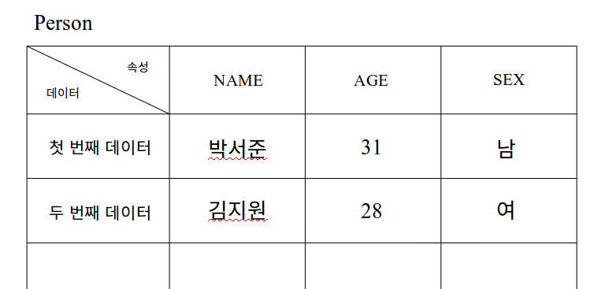

#멋사 9주차 세션 - 댓글 1:N 관계 구성하기

Model 관계 이해하기

 

### Model

데이터 모델이란 현실의 어떠한 것을 추상화한 모형이다.

예를 들어, 모델을 **사람**이라고 가정해보자. 그리고 사람이 가지고 있는 **속성**은 이름, 나이, 성별로 표현한다.

그런 후, 사람을 추상화한 모형인 데이터 모델은 아래와 같이 테이블 표 형태로 표현할 수 있다.




- Person => 데이터 모델명
- Name, Age, Sex => 속성 (속성은 테이블의 열에 위치한다)
- (박서준, 31, 남), (김지원, 28, 여) => 데이터 (데이터는 테이블의 행에 위치한다) 
- 데이터 모델은 하나의 추상적인 **틀**을 의미하고, **속성**이라는 기준을 가지고 구체적인 뼈대를 구성한다.
- 그리고 해당하는 틀과 기준에 맞추어 **데이터**를 생성하여 저장하고, 수정, 삭제, 검색을 할 수 있다.


###데이터 모델 구상하기 (스키마 작성) 

데이터 모델은 스키마(Schema, 계획-도식)라고도 하며, 스키마는 모델의 구체적 윤곽을 보여준다.

```markdown
1. 자신이 만들고 싶은 모델 이름을 짓는다.
2. 모델의 속성을 부여한다.
3. 이렇게 만든 데이터 모델을 실제로 사용할 수 있도록, 마이그레이션 해준다.
4. 데이터를 만들고 테이블에 저장한다.

* 마이그레이션이란?
마이그레이션은 이전, 통합이라고도 한다.
우리가 생성한 데이터 모델을 'rails_db' 프로그램에서 관리할 수 있도록 건네준다. 또한 기존 사항의 변경이 있으면 마이그레이션을 통해 새로운 변경사항에 맞춰 통합해준다.
```


###루비 작성법

Person 이라는 모델을 만들고 데이터를 저장해보자.

1) 데이터 모델 생성

```ruby
rails g model Person # rails g model 모델명 
```

2) 모델 속성 부여하기

폴더 db/migrate 안에 생성된 파일을 연다. 파일 형식은 생성날짜_ create _모델명

```
class Create모델명 < ActiveRecord::Migration[5.0]
  def change
    create_table :모델명 do |t|
      
      t.timestamps
    end
  end
end
```

3) 마이그레이션

```
rails db:migrate

# rails db:drop -> 기존에 마이그레이션된 정보들을 제거한다.
```

4) 새로운 데이터 생성하기 

```
rails console # 콘솔창으로 접속한다.
firstdata = Person.new # 모델명.new로 새로운 빈 데이터 줄을 만들고 firstdata 변수에 저장한다. (모델명의 앞 글자는 대문자)
firstdata.name = '박서준' # 모델 속성에 맞추어 정보를 채워넣는다.
firstdata.age = 31
firstdata.sex = '남'
first.save # 데이터베이스에 저장
```

